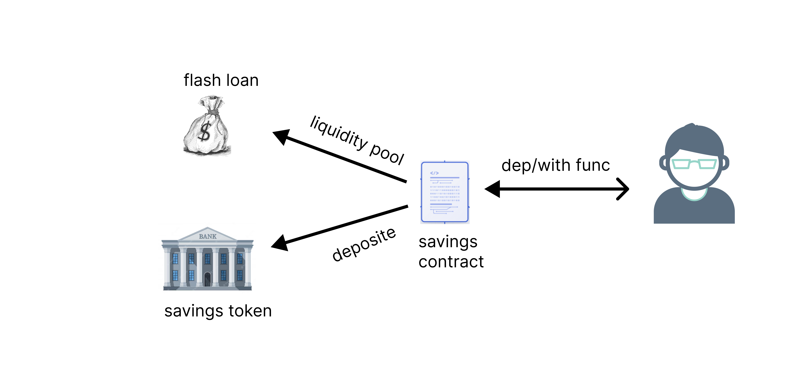

# <div align='center'>FantomHack (Defi FanSave) #1</div> 

A decentralised saving platform where user is allowed to save their crypto currency on the contract mostly fantom token or be allowed to deposite their money in a liquidity pool to gain intrest on their saving and seek for flash loan with some depositor amount or the level of saving which such user an saved throughout the period of their account activation

## Diagram Explanation


## Function scope

## <div align='center'> Deposite function</div>

``` shell

Allow user to deposite fantom token to the smart contract allow them to save their money for a specified period of time set by the user also allow depositing of token any time 

````

## <div align='center'> Widthdrawal function</div>

````shell

user specified the timeframe to remove their token from the smart contract which is set by the user 

````

## <div align='center'> Flash Loans function</div>


